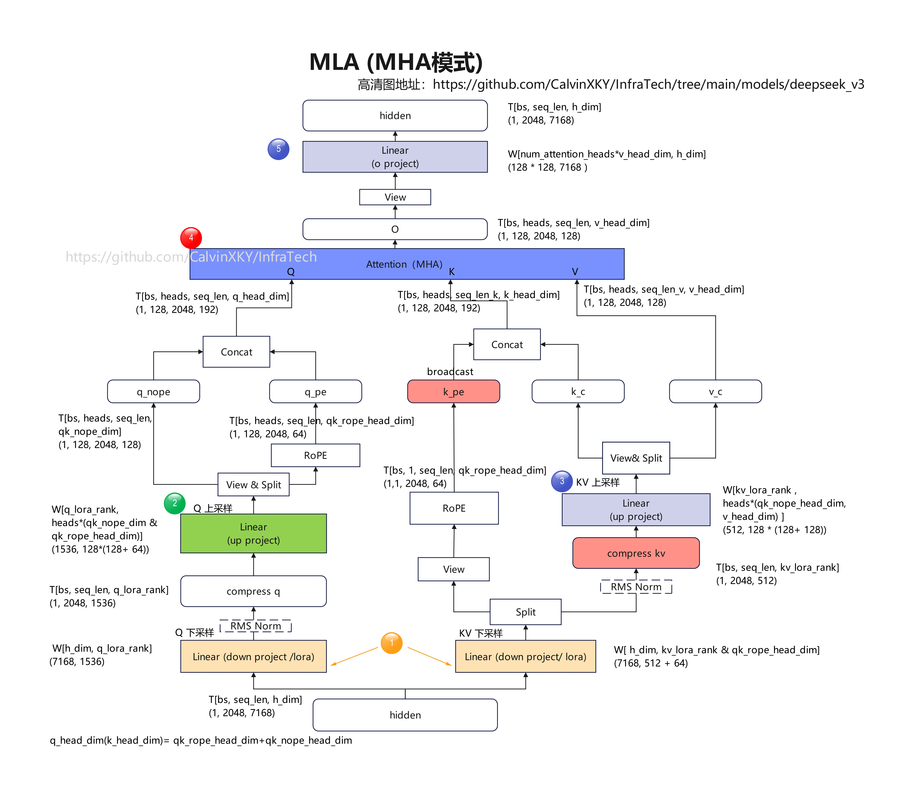
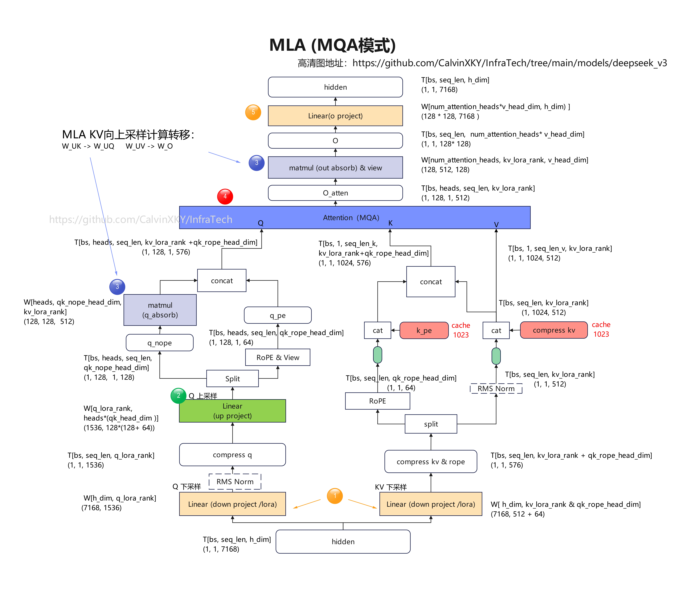

# DeepSeek 系列 Attention 机制公式推导

> 本文档仅保留计算公式与官方参考代码，推理优化实现细节（NPU 融合算子、多流并行、MLAPO 等）请见 [`SFA.md`](./SFA.md)。

---

# 1. MLA (Multi-head Latent Attention)

> 适用模型：DeepSeek-V2 / V3 / V3.1

## 1.1 符号说明

| 符号 | 含义 | 符号 | 含义 |
|------|------|------|------|
| $h_t$ | 第 $t$ 个 token 的输入向量 | $n_h$ | 注意力头数 |
| $d$ | 嵌入维度 | $d_c, d'_c$ | KV 与 Query 压缩维度 |
| $d_h$ | 单头维度 | $d_h^R$ | RoPE 维度 |
| $W$ | 投影矩阵 | $[\cdot;\cdot]$ | 向量拼接 |
| $c$ | 压缩后的潜向量 | $C, R$ | 内容 (Content) 与 旋转 (Rotary) 部分 |

---





## 1.2 KV 生成与压缩

仅缓存 $c_t^{KV}$ 和 $k_t^R$ 以节省显存。

$$
\begin{aligned}
c_t^{KV} &= W_{DKV} h_t & \quad & \text{(KV 压缩)} \\
[k_{t,1}^C; \dots; k_{t,n_h}^C] = k_t^C &= W_{UK} c_t^{KV} & \quad & \text{(内容 Key 解压缩)} \\
k_t^R &= \text{RoPE}(W_{KR} h_t) & \quad & \text{(旋转 Key，多头共享)} \\
k_{t,i} &= [k_{t,i}^C; k_t^R] & \quad & \text{(完整 Key)} \\
[v_{t,1}^C; \dots; v_{t,n_h}^C] = v_t^C &= W_{UV} c_t^{KV} & \quad & \text{(Value 解压缩)}
\end{aligned}
$$

---

## 1.3 Query 生成与压缩

$$
\begin{aligned}
c_t^Q &= W_{DQ} h_t & \quad & \text{(Query 压缩)} \\
[q_{t,1}^C; \dots; q_{t,n_h}^C] = q_t^C &= W_{UQ} c_t^Q & \quad & \text{(内容 Query 解压缩)} \\
[q_{t,1}^R; \dots; q_{t,n_h}^R] = q_t^R &= \text{RoPE}(W_{QR} c_t^Q) & \quad & \text{(旋转 Query，分头计算)} \\
q_{t,i} &= [q_{t,i}^C; q_{t,i}^R] & \quad & \text{(完整 Query)}
\end{aligned}
$$

---

## 1.4 注意力计算

$$
\begin{aligned}
o_{t,i} &= \sum_{j=1}^{t} \text{Softmax}_j \big( \frac{q_{t,i}^\top k_{j,i}}{\sqrt{d_h + d_h^R}} \big) v_{j,i}^C & \quad & \text{(单头注意力输出)} \\
u_t &= W_O [o_{t,1}; \dots; o_{t,n_h}] & \quad & \text{(最终输出投影)}
\end{aligned}
$$

---

## 1.5 吸收 (Absorbed / MQA) vs 非吸收 (Non-absorbed / MHA)

| 模式 | 核心区别 | 缓存内容 |
|------|----------|----------|
| **MHA (非吸收)** | 分别计算 $k_{t,i}, v_{t,i}$，按头存储 | 每头独立的 K/V cache |
| **MQA (吸收)** | 将 $W_{UK}, W_{UV}$ 吸收进 Q/O，仅存 $c_t^{KV}$ | 仅存 $c_t^{KV}$ 和共享的 $k_t^R$ |

---

## 1.6 参考代码：transformers `DeepseekV3Attention`

以下代码来自 `transformers` 官方实现，仅保留核心的 Q/KV 投影与 Attention 逻辑，去除了分布式、量化、FlashAttention 等优化细节，便于理解公式对应关系。

```python
class DeepseekV3Attention(nn.Module):
    def __init__(self, config: DeepseekV3Config, layer_idx: int):
        super().__init__()
        self.num_heads = config.num_attention_heads

        self.q_lora_rank = config.q_lora_rank
        self.qk_rope_head_dim = config.qk_rope_head_dim
        self.kv_lora_rank = config.kv_lora_rank
        self.v_head_dim = config.v_head_dim
        self.qk_nope_head_dim = config.qk_nope_head_dim
        self.qk_head_dim = config.qk_head_dim

        # Query 压缩路径: W_DQ -> layernorm -> W_UQ
        if self.q_lora_rank is None:
            self.q_proj = nn.Linear(config.hidden_size, self.num_heads * self.qk_head_dim, bias=False)
        else:
            self.q_a_proj = nn.Linear(config.hidden_size, config.q_lora_rank, bias=config.attention_bias)
            self.q_a_layernorm = DeepseekV3RMSNorm(config.q_lora_rank)
            self.q_b_proj = nn.Linear(config.q_lora_rank, self.num_heads * self.qk_head_dim, bias=False)

        # KV 压缩路径: W_DKV (带 MQA) -> layernorm -> W_UK / W_UV
        self.kv_a_proj_with_mqa = nn.Linear(
            config.hidden_size,
            self.kv_lora_rank + self.qk_rope_head_dim,  # c_t^KV + k_t^R
            bias=config.attention_bias,
        )
        self.kv_a_layernorm = DeepseekV3RMSNorm(self.kv_lora_rank)
        self.kv_b_proj = nn.Linear(
            self.kv_lora_rank,
            self.num_heads * (self.qk_nope_head_dim + self.v_head_dim),
            bias=False,
        )

        self.o_proj = nn.Linear(self.num_heads * self.v_head_dim, config.hidden_size, bias=False)
        self.scaling = self.qk_head_dim ** (-0.5)

    def forward(self, hidden_states, position_embeddings, attention_mask, past_key_values=None, **kwargs):
        batch_size, seq_length = hidden_states.shape[:-1]
        query_shape = (batch_size, seq_length, -1, self.qk_head_dim)
        key_shape = (batch_size, seq_length, -1, self.qk_nope_head_dim + self.v_head_dim)

        # ===== Query 计算 =====
        # 对应公式: c_t^Q = W_DQ h_t -> W_UQ c_t^Q = q_t^C
        if self.q_lora_rank is None:
            q_states = self.q_proj(hidden_states)
        else:
            q_states = self.q_b_proj(self.q_a_layernorm(self.q_a_proj(hidden_states)))
        q_states = q_states.view(query_shape).transpose(1, 2)
        # 拆分内容部分 q_nope 和旋转部分 q_rot
        q_pass, q_rot = torch.split(q_states, [self.qk_nope_head_dim, self.qk_rope_head_dim], dim=-1)

        # ===== KV 计算 =====
        # 对应公式: [c_t^KV; k_t^R] = W_DKV h_t
        compressed_kv = self.kv_a_proj_with_mqa(hidden_states)
        k_pass, k_rot = torch.split(compressed_kv, [self.kv_lora_rank, self.qk_rope_head_dim], dim=-1)

        # 对应公式: [k_t^C; v_t^C] = W_UK/V c_t^KV
        k_pass = self.kv_b_proj(self.kv_a_layernorm(k_pass)).view(key_shape).transpose(1, 2)
        k_pass, value_states = torch.split(k_pass, [self.qk_nope_head_dim, self.v_head_dim], dim=-1)

        k_rot = k_rot.view(batch_size, 1, seq_length, self.qk_rope_head_dim)

        # ===== RoPE =====
        cos, sin = position_embeddings
        q_rot, k_rot = apply_rotary_pos_emb(q_rot, k_rot, cos, sin)
        k_rot = k_rot.expand(*k_pass.shape[:-1], -1)

        # 拼接完整 Query / Key
        query_states = torch.cat((q_pass, q_rot), dim=-1)
        key_states = torch.cat((k_pass, k_rot), dim=-1)

        if past_key_values is not None:
            key_states, value_states = past_key_values.update(key_states, value_states, self.layer_idx)

        # ===== Attention =====
        attn_output, attn_weights = eager_attention_forward(
            self, query_states, key_states, value_states,
            attention_mask, scaling=self.scaling, **kwargs
        )

        attn_output = attn_output.reshape(batch_size, seq_length, -1).contiguous()
        attn_output = self.o_proj(attn_output)
        return attn_output, attn_weights
```

> 注：上述代码为 **非吸收 (MHA)** 版本，完整保留了 $W_{UK}, W_{UV}$ 的显式计算。生产环境的 **吸收 (MQA)** 版本会将 $W_{UK}^\top$ 提前与 $q_{t,i}^C$ 相乘，$W_{UV}$ 延迟到 Attention 输出后再乘，从而将 KV cache 压缩为单个 $c_t^{KV}$。详见 [`SFA.md`](./SFA.md) 中 MindIE / vLLM-Ascend / SGLang 的实现分析。

---

# 2. SFA / DSA (Sparse Flash Attention)

> 适用模型：DeepSeek-V3.2 / GLM-5 等

SFA 在 MLA 基础上增加了 **Lightning Indexer**，用于计算 token 级别的相关性分数并筛选 Top-K KV 条目。

## 2.1 Lightning Indexer 符号说明

| 符号 | 含义 | 符号 | 含义 |
|------|------|------|------|
| $h_t, h_s$ | 当前 Query token 与历史 Key token | $H_I$ | Indexer 头数 |
| $d_I$ | Indexer 投影维度 | $I_{t,s}$ | Token 间索引分数 |
| $q^I, k^I$ | Indexer 查询与键向量 | $w^I$ | Indexer 标量权重 |
| $c_s$ | 压缩后的 KV 条目 | $u_t$ | 注意力输出 |
| $\text{Top-k}$ | 前 $k$ 个高分选择 | | |


## 2.2 索引分数计算

计算当前 token $t$ 与历史 token $s$ 之间的相关性分数：

$$
\begin{aligned}
I_{t,s} &= \sum_{j=1}^{H_I} w_{t,j}^I \cdot \text{ReLU}( q_{t,j}^I \cdot k_s^I )
\end{aligned}
$$

* $q_{t,j}^I, w_{t,j}^I$ 源自 $h_t$；$k_{s}^I$ 源自 $h_s$。
* 采用 ReLU 激活函数以提升吞吐量。

## 2.3 稀疏选择与注意力

根据索引分数筛选 Top-k 个 KV 条目进行注意力计算：

$$
\begin{aligned}
\mathcal{S}_t &= \{ s \mid I_{t,s} \in \text{Top-k}(I_{t,:}) \} & \quad & \text{(选中 token 集合)} \\
u_t &= \text{Attn}( h_t, \{ c_s \mid s \in \mathcal{S}_t \} ) & \quad & \text{(稀疏注意力输出)}
\end{aligned}
$$

* 仅对索引分数最高的 $k$ 个历史 token 对应的 $c_s$ 进行注意力运算。

## 2.4 参考代码：DeepSeek-V3.2 官方 `inference/model.py`

以下代码来自 DeepSeek-V3.2-Exp 官方推理仓库，包含 `Indexer` 与带稀疏选择的 `MLA` 完整实现。

```python
class Indexer(torch.nn.Module):
    def __init__(self, args: ModelArgs):
        super().__init__()
        self.dim: int = args.dim
        self.n_heads: int = args.index_n_heads
        self.n_local_heads = args.index_n_heads // world_size
        self.head_dim: int = args.index_head_dim
        self.rope_head_dim: int = args.qk_rope_head_dim
        self.index_topk: int = args.index_topk
        self.q_lora_rank: int = args.q_lora_rank

        # Indexer Q 投影: 输入为 q_lora (c_t^Q)
        self.wq_b = Linear(self.q_lora_rank, self.n_heads * self.head_dim)
        # Indexer K 投影: 输入为 hidden_states (h_s)
        self.wk = Linear(self.dim, self.head_dim)
        self.k_norm = LayerNorm(self.head_dim)
        # 标量权重投影
        self.weights_proj = Linear(self.dim, self.n_heads, dtype=torch.float32)
        self.softmax_scale = self.head_dim ** -0.5

    def forward(self, x: torch.Tensor, qr: torch.Tensor, start_pos: int, freqs_cis: torch.Tensor, mask):
        bsz, seqlen, _ = x.size()
        end_pos = start_pos + seqlen

        # ===== Indexer Q: q_{t,j}^I =====
        q = self.wq_b(qr)
        q = q.view(bsz, seqlen, self.n_heads, self.head_dim)
        q_pe, q_nope = torch.split(q, [self.rope_head_dim, self.head_dim - self.rope_head_dim], dim=-1)
        q_pe = apply_rotary_emb(q_pe, freqs_cis, interleaved=False)
        q = torch.cat([q_pe, q_nope], dim=-1)

        # ===== Indexer K: k_s^I =====
        k = self.wk(x)
        k = self.k_norm(k)
        k_pe, k_nope = torch.split(k, [self.rope_head_dim, self.head_dim - self.rope_head_dim], dim=-1)
        k_pe = apply_rotary_emb(k_pe.unsqueeze(2), freqs_cis, interleaved=False).squeeze(2)
        k = torch.cat([k_pe, k_nope], dim=-1)

        # FP8 量化后存入 k_cache (实际部署优化)
        # ...

        # ===== 索引分数计算 + TopK =====
        weights = self.weights_proj(x.float()) * self.n_heads ** -0.5
        weights = weights.unsqueeze(-1) * q_scale * self.softmax_scale
        index_score = fp8_index(q_fp8, weights, self.k_cache[:bsz, :end_pos], self.k_scale_cache[:bsz, :end_pos])
        if mask is not None:
            index_score += mask
        topk_indices = index_score.topk(min(self.index_topk, end_pos), dim=-1)[1]
        return topk_indices


class MLA(nn.Module):
    def __init__(self, args: ModelArgs):
        super().__init__()
        # ... 同 V3 的投影定义 ...
        self.indexer = Indexer(args)

    def forward(self, x: torch.Tensor, start_pos: int, freqs_cis: torch.Tensor, mask):
        bsz, seqlen, _ = x.size()
        end_pos = start_pos + seqlen

        # ===== Query / KV 投影 (同 V3) =====
        qr = self.q_norm(self.wq_a(x))
        q = self.wq_b(qr)
        q = q.view(bsz, seqlen, self.n_local_heads, self.qk_head_dim)
        q_nope, q_pe = torch.split(q, [self.qk_nope_head_dim, self.qk_rope_head_dim], dim=-1)
        q_pe = apply_rotary_emb(q_pe, freqs_cis)

        kv = self.wkv_a(x)
        kv, k_pe = torch.split(kv, [self.kv_lora_rank, self.qk_rope_head_dim], dim=-1)
        kv = self.kv_norm(kv)
        k_pe = apply_rotary_emb(k_pe.unsqueeze(2), freqs_cis)
        self.kv_cache[:bsz, start_pos:end_pos] = kv
        self.pe_cache[:bsz, start_pos:end_pos] = k_pe.squeeze(2)

        if mask is not None:    # MHA Prefill 路径
            q = torch.cat([q_nope, q_pe], dim=-1)
            kv = self.wkv_b(kv).view(bsz, seqlen, self.n_local_heads, self.qk_nope_head_dim + self.v_head_dim)
            k_nope, v = torch.split(kv, [self.qk_nope_head_dim, self.v_head_dim], dim=-1)
            k = torch.cat([k_nope, k_pe.expand(-1, -1, self.n_local_heads, -1)], dim=-1)
            scores = torch.einsum("bshd,bthd->bsht", q, k).mul_(self.softmax_scale)

            # 加入 Indexer 稀疏掩码
            topk_indices = self.indexer(x, qr, start_pos, freqs_cis, mask)
            index_mask = torch.full((bsz, seqlen, seqlen), float("-inf"), device=x.device)
            index_mask = index_mask.scatter_(-1, topk_indices, 0)
            index_mask += mask
            scores += index_mask.unsqueeze(2)

            scores = scores.softmax(dim=-1)
            x = torch.einsum("bsht,bthd->bshd", scores, v)
        else:                   # MQA Decode 路径 (吸收)
            wkv_b = self.wkv_b.weight.view(self.n_local_heads, -1, self.kv_lora_rank)
            q_nope = torch.einsum("bshd,hdc->bshc", q_nope, wkv_b[:, :self.qk_nope_head_dim])
            scores = (torch.einsum("bshc,btc->bsht", q_nope, self.kv_cache[:bsz, :end_pos]) +
                      torch.einsum("bshr,btr->bsht", q_pe, self.pe_cache[:bsz, :end_pos])) * self.softmax_scale

            # 加入 Indexer 稀疏掩码
            topk_indices = self.indexer(x, qr, start_pos, freqs_cis, mask)
            index_mask = torch.full((bsz, 1, end_pos), float("-inf"), device=x.device)
            index_mask = index_mask.scatter_(-1, topk_indices, 0)
            scores += index_mask.unsqueeze(2)

            scores = scores.softmax(dim=-1)
            x = torch.einsum("bsht,btc->bshc", scores, self.kv_cache[:bsz, :end_pos])
            x = torch.einsum("bshc,hdc->bshd", x, wkv_b[:, -self.v_head_dim:])

        x = self.wo(x.flatten(2))
        return x
```

> 注：V3.2 的 `MLA` 同时包含 **MHA (Prefill)** 和 **MQA (Decode)** 两条路径，并通过 `Indexer` 在两条路径上均施加稀疏掩码。生产环境的 NPU 实现（MindIE / vLLM-Ascend / SGLang）仅实现了 MQA（吸收）路径，并替换为 `npu_lightning_indexer` 与 `npu_sparse_flash_attention` 融合算子。

---

# 3. DeepSeek-V4 Attention

> 适用模型：DeepSeek-V4

V4 在 MLA 基础上做了进一步简化与改进：

1. **纯 MQA**：彻底取消多头 KV，仅保留单头 $kv_{proj}$，$K=V$ 共享同一份投影。
2. **Partial RoPE**：仅对前 `rope_head_dim` 个维度施加 RoPE，并在 Attention 输出后对 rope slice 施加共轭旋转（`-sin`），保证相对位置不变性。
3. **Grouped Low-rank Output Projection**：$W_{O}$ 拆分为 $W_{Oa}$ (GroupedLinear) + $W_{Ob}$，降低输出投影参数量。
4. **Attention Sink**：每头引入可学习的标量 `sinks`，作为全局 attention sink。
5. **分层 Cache 机制**：
   - `sliding_attention`：纯滑动窗口，无压缩。
   - `compressed_sparse_attention` (CSA)：滑动窗口 + 压缩稀疏 KV。
   - `heavily_compressed_attention` (HCA)：滑动窗口 + 重度压缩长程 KV。


## 3.1 核心公式

### Query 投影 (保留低秩)

$$
\begin{aligned}
c_t^Q &= W_{DQ} h_t \\
q_{t,i} &= W_{UQ} c_t^Q \quad \text{(再经 q-b-norm + RoPE)}
\end{aligned}
$$

### KV 投影 (单头 MQA)

$$
\begin{aligned}
c_t^{KV} &= W_{KV} h_t \quad \text{(直接投影到单头维度)} \\
k_t &= v_t = \text{RoPE}(\text{LayerNorm}(c_t^{KV})) \quad \text{(K=V 共享)}
\end{aligned}
$$

### 压缩 KV (CSA / HCA)

压缩器将滑动窗口外的历史 token 聚合成少量压缩条目 $C^{\text{Comp}}$：

$$
\begin{aligned}
\text{compressed-kv} &= \text{Compressor}(h_t, c_t^Q, \dots) \\
k_t^{\text{total}} &= \big[\, k_t^{\text{sliding}}; \text{compressed-kv} \,\big] \quad \text{(拼接滑动窗口 + 压缩条目)}
\end{aligned}
$$

### Attention + Sink

$$
\begin{aligned}
\text{scores}_{t,s} &= \frac{q_t^\top k_s}{\sqrt{d_h}} + \text{sink}_i \quad \text{(per-head learnable sink)} \\
o_t &= \text{Softmax}(\text{scores}) \cdot v_t
\end{aligned}
$$

### 输出共轭旋转与分组投影

$$
\begin{aligned}
o_t' &= \text{RoPE}^{-1}(o_t) \quad \text{(对 rope slice 施加 -sin 共轭旋转)} \\
u_t &= W_{Ob}(W_{Oa}(o_t'))
\end{aligned}
$$

## 3.2 参考代码：transformers `DeepseekV4Attention`

以下代码来自 `transformers` 官方 `modeling_deepseek_v4.py`，展示了 V4 的核心简化：

```python
class DeepseekV4Attention(nn.Module):
    def __init__(self, config: DeepseekV4Config, layer_idx: int):
        super().__init__()
        self.config = config
        self.layer_idx = layer_idx
        self.layer_type = config.layer_types[layer_idx]
        self.num_heads = config.num_attention_heads
        # V4 彻底使用单头 MQA: num_key_value_groups = num_heads
        self.num_key_value_groups = config.num_attention_heads
        self.head_dim = config.head_dim
        self.sliding_window = config.sliding_window
        self.scaling = self.head_dim**-0.5

        # Query 低秩投影 (保留)
        self.q_a_proj = nn.Linear(config.hidden_size, config.q_lora_rank, bias=False)
        self.q_a_norm = DeepseekV4RMSNorm(config.q_lora_rank, eps=config.rms_norm_eps)
        self.q_b_proj = nn.Linear(config.q_lora_rank, self.num_heads * self.head_dim, bias=False)
        self.q_b_norm = DeepseekV4UnweightedRMSNorm(eps=config.rms_norm_eps)

        # KV 单头投影 (最简 MQA)
        self.kv_proj = nn.Linear(config.hidden_size, self.head_dim, bias=False)
        self.kv_norm = DeepseekV4RMSNorm(self.head_dim, eps=config.rms_norm_eps)

        # 分组低秩输出投影: W_O = W_Ob @ W_Oa
        self.o_a_proj = DeepseekV4GroupedLinear(
            self.num_heads * self.head_dim // config.o_groups,
            config.o_groups * config.o_lora_rank,
            config.o_groups,
        )
        self.o_b_proj = nn.Linear(config.o_groups * config.o_lora_rank, config.hidden_size, bias=False)

        # 可学习的 Attention Sink
        self.sinks = nn.Parameter(torch.empty(self.num_heads))

        # 压缩器 (CSA 或 HCA，sliding_attention 层为 None)
        self.compressor = (
            COMPRESSOR_CLASSES[self.layer_type](config)
            if self.layer_type != "sliding_attention"
            else None
        )

    def forward(self, hidden_states, position_embeddings, position_ids, attention_mask, past_key_values=None, **kwargs):
        input_shape = hidden_states.shape[:-1]
        hidden_shape = (*input_shape, -1, self.head_dim)
        cos, sin = position_embeddings

        # ===== Query: c_t^Q -> W_UQ -> q_b_norm -> RoPE =====
        q_residual = self.q_a_norm(self.q_a_proj(hidden_states))
        q = self.q_b_proj(q_residual).view(*hidden_shape).transpose(1, 2)
        q = self.q_b_norm(q)
        q = apply_rotary_pos_emb(q, cos, sin)

        # ===== KV: 单头投影 -> norm -> RoPE (K=V 共享) =====
        kv = self.kv_norm(self.kv_proj(hidden_states)).view(*hidden_shape).transpose(1, 2)
        kv = apply_rotary_pos_emb(kv, cos, sin)

        # 滑动窗口 Cache 更新
        if past_key_values is not None:
            kv = past_key_values.update(kv, kv, self.layer_idx)[0]

        # 压缩 KV (CSA / HCA)
        if self.compressor is not None:
            compressed_kv = self.compressor(hidden_states, q_residual, position_ids, past_key_values, self.layer_idx)
            kv = torch.cat([kv, compressed_kv], dim=2)

        # Attention mask 补齐压缩条目长度
        if isinstance(attention_mask, torch.Tensor) and kv.shape[2] > attention_mask.shape[-1]:
            attention_mask = F.pad(attention_mask, (0, kv.shape[2] - attention_mask.shape[-1]), value=0.0)

        # ===== Attention (K=V 传入两次) =====
        attn_output, attn_weights = eager_attention_forward(
            self, q, kv, kv, attention_mask,
            scaling=self.scaling,
            sliding_window=self.sliding_window,
            s_aux=self.sinks,  # attention sink
            **kwargs,
        )

        # ===== 输出共轭旋转: 对 rope slice 施加 -sin =====
        attn_output = apply_rotary_pos_emb(attn_output.transpose(1, 2), cos, -sin).transpose(1, 2)

        # ===== 分组低秩输出投影 =====
        grouped = attn_output.reshape(*input_shape, self.config.o_groups, -1)
        grouped = self.o_a_proj(grouped).flatten(2)
        output = self.o_b_proj(grouped)
        return output, attn_weights
```

> 注：V4 的 `Compressor` 模块（CSA / HCA）实现较为复杂，涉及窗口缓冲、重叠状态、softmax-gated 聚合等，本文档不展开其内部公式，详细实现请参考 `transformers` 源码中的 `DeepseekV4CSACache`、`DeepseekV4HCACache` 与对应的 `Compressor` 类。

---

# 附录：版本演进对照

| 特性 | DeepSeek-V3 (MLA) | DeepSeek-V3.2 (SFA) | DeepSeek-V4 |
|------|-------------------|---------------------|-------------|
| KV 压缩 | 低秩 $c_t^{KV}$ | 低秩 $c_t^{KV}$ | 单头投影 $c_t^{KV}$ |
| Query 压缩 | 低秩 $c_t^Q$ | 低秩 $c_t^Q$ | 低秩 $c_t^Q$ |
| 稀疏选择 | 无 | Lightning Indexer (Top-K) | 压缩器 (CSA/HCA) |
| 注意力模式 | MHA + MQA | MHA + MQA | 纯 MQA |
| RoPE 处理 | 标准 | 标准 | Partial + 共轭旋转 |
| 输出投影 | 标准 $W_O$ | 标准 $W_O$ | 分组低秩 $W_{Oa}+W_{Ob}$ |
| Sink | 无 | 无 | 可学习 per-head sink |

---

*文档生成日期：2026-05-10*
