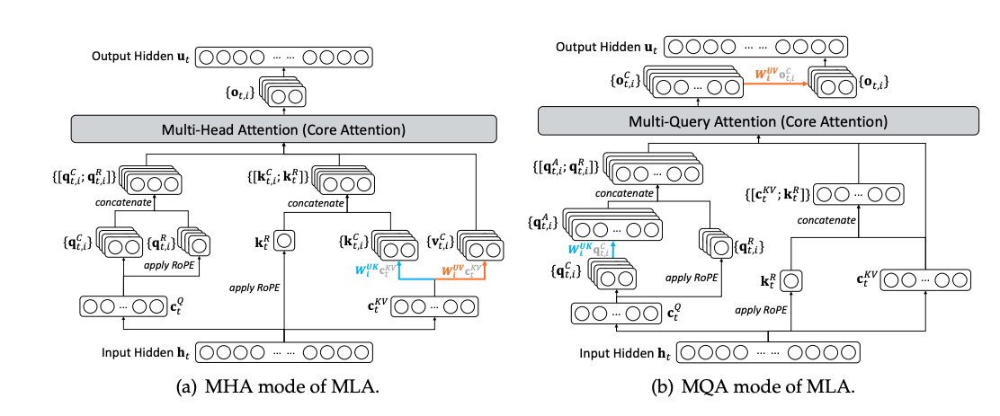
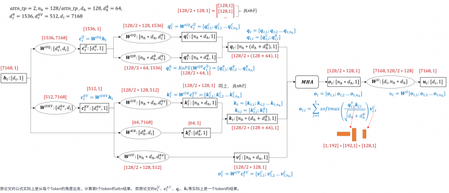
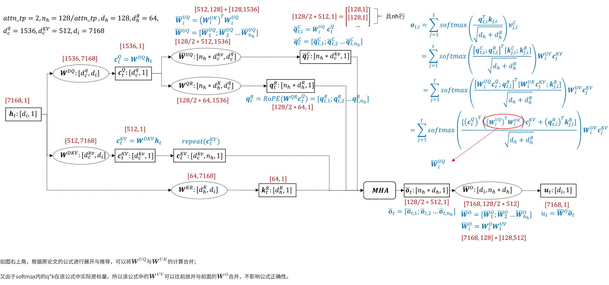
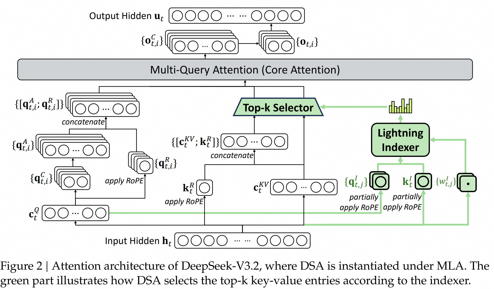

# MLA

> 用于模型：DeepSeekV2 DeepSeekV3 DeepSeekV3.1

## 计算原理

### 总体框架


### 计算公式解析

### DeepSeek-V3 MLA 计算公式整理

#### 1. 符号说明

| 符号  | 含义                       | 符号            | 含义                                     |
| ----- | -------------------------- | --------------- | ---------------------------------------- |
| $h_t$ | 第 $t$ 个 token 的输入向量 | $n_h$           | 注意力头数                               |
| $d$   | 嵌入维度                   | $d_c, d'_c$     | KV 与 Query 压缩维度                     |
| $d_h$ | 单头维度                   | $d_h^R$         | RoPE 维度                                |
| $W$   | 投影矩阵                   | $[\cdot;\cdot]$ | 向量拼接                                 |
| $c$   | 压缩后的潜向量             | $C, R$          | 内容 (Content) 与 旋转 (Rotary) 部分 |

***

#### 2. KV 生成与压缩 (Key-Value Generation)

仅缓存 $c_t^{KV}$ 和 $k_t^R$ 以节省显存。

$$
\begin{aligned}
c_t^{KV} &= W_{DKV} h_t & \quad & \text{(KV 压缩)} \\
{[}k_{t,1}^C; \dots; k_{t,n_h}^C{]} = k_t^C &= W_{UK} c_t^{KV} & \quad & \text{(内容 Key 解压缩)} \\
k_t^R &= \text{RoPE}(W_{KR} h_t) & \quad & \text{(旋转 Key，多头共享)} \\
k_{t,i} &= {[}k_{t,i}^C; k_t^R{]} & \quad & \text{(完整 Key)} \\
{[}v_{t,1}^C; \dots; v_{t,n_h}^C{]} = v_t^C &= W_{UV} c_t^{KV} & \quad & \text{(Value 解压缩)}
\end{aligned}
$$

***

#### 3. Query 生成与压缩 (Query Generation)

$$
\begin{aligned}
c_t^Q &= W_{DQ} h_t & \quad & \text{(Query 压缩)} \\
{[}q_{t,1}^C; \dots; q_{t,n_h}^C{]} = q_t^C &= W_{UQ} c_t^Q & \quad & \text{(内容 Query 解压缩)} \\
{[}q_{t,1}^R; \dots; q_{t,n_h}^R{]} = q_t^R &= \text{RoPE}(W_{QR} c_t^Q) & \quad & \text{(旋转 Query，分头计算)} \\
q_{t,i} &= {[}q_{t,i}^C; q_{t,i}^R{]} & \quad & \text{(完整 Query)}
\end{aligned}
$$

***

#### 4. 注意力计算 (Attention Calculation)

$$
\begin{aligned}
o_{t,i} &= \sum_{j=1}^{t} \text{Softmax}_j \big( \frac{q_{t,i}^\top k_{j,i}}{\sqrt{d_h + d_h^R}} \big) v_{j,i}^C & \quad & \text{(单头注意力输出)} \\
u_t &= W_O {[}o_{t,1}; \dots; o_{t,n_h}{]} & \quad & \text{(最终输出投影)}
\end{aligned}
$$

#### 计算图

> 什么是吸收（MQA）？什么是非吸收（MHA）？
> 

##### 非吸收的MLA （MHA版本）



##### 吸收的MLA （MQA版本）



## MindIE-LLM实现

> 待补充

# SFA

> 用于DeepSeekV3.2，GLM5等



## 计算原理

仅仅比MLA多一个Lightning Indexer

### Lightning Indexer 计算公式整理

#### 1. 符号说明

| 符号           | 含义                                     | 符号      | 含义             |
| -------------- | ---------------------------------------- | --------- | ---------------- |
| $h_t, h_s$     | 当前 Query  token 与 preceding Key token | $H_I$     | Indexer 头数     |
| $d_I$          | Indexer 投影维度                         | $I_{t,s}$ | Token 间索引分数 |
| $q^I, k^I$     | Indexer 查询与键向量                     | $w^I$     | Indexer 标量权重 |
| $c_s$          | 压缩后的 KV 条目                         | $u_t$     | 注意力输出       |
| $\text{Top-k}$ | 前 $k$ 个高分选择                        | $\cdot$   | 点积或标量乘法   |

***

#### 2. 索引分数计算 (Index Score Calculation)

计算当前 token $t$ 与历史 token $s$ 之间的相关性分数。

$$
\begin{aligned}
I_{t,s} &= \sum_{j=1}^{H_I} w_{t,j}^I \cdot \text{ReLU}( q_{t,j}^I \cdot k_s^I )
\end{aligned}
$$

* $q_{t,j}^I, w_{t,j}^I$ 源自 $h_t$；$k_s^I$ 源自 $h_s$。

* 采用 ReLU 激活函数以提升吞吐量。

***

#### 3. 稀疏选择与注意力 (Sparse Selection & Attention)

根据索引分数筛选 Top-k 个 KV 条目进行注意力计算。

$$
\begin{aligned}
\mathcal{S}_t &= \{ s \mid I_{t,s} \in \text{Top-k}(I_{t,:}) \} & \quad & \text{(选中 token 集合)} \\
u_t &= \text{Attn}( h_t, \{ c_s \mid s \in \mathcal{S}_t \} ) & \quad & \text{(稀疏注意力输出)}
\end{aligned}
$$

* 仅对索引分数最高的 $k$ 个历史 token 对应的 $c_s$ 进行注意力运算。

* 支持 FP8 实现以保证计算效率。

> 当前vllm和MindIE的代码实现只有吸收（MQA）版本，但是ds官方代码仓有非吸收（MHA）版本和吸收（MQA）版本


## MindIE-LLM实现

> dsv32实现只有吸收版本

### 代码实现的计算图


### 关键代码

> 仅展示关键代码 具体代码在mindie\_llm\\runtime\\layers\\attention\\backend\\sparse\_attention.py

##### q k v的preprocess

```python
def sfa_preprocess(...):
    ...
    ckq = self.q_a_proj(hidden_states) # 对应q_c计算
    q_c = self.q_a_layernorm(ckq)
    ...
    kv_no_split = self.kv_a_proj_with_mqa(hidden_states)
    ...

def sfa_prefill_preprocess(...):
    # =============q相关的计算================
    # 这里decode 命名不好，明明是prefill
    decode_q = self.q_b_proj(q_c) # q_b_proj
    bsz, _ = decode_q.shape
    decode_q = decode_q.view(bsz, self.num_heads_per_rank, 1, self.qk_head_dim) # 分head
    decode_q_nope, decode_q_pe = torch.split(
        decode_q, [self.qk_nope_head_dim, self.qk_rope_head_dim], dim=-1
    ) # split nope和rope
    decode_q_nope = decode_q_nope.view(-1, self.num_heads_per_rank, self.qk_nope_head_dim).transpose(0, 1) # 转置为(head_num, bsz, nope_dim) 这里转置是为了后面分别对每个head做matmul
    decode_q_nope = (
        torch.matmul(decode_q_nope, self.kv_b_proj_w_k) # 这里的kv_b_proj_w_k明明不好，明明是对q做投影
        .transpose(1, 0)
        .view(bsz, 1, self.num_heads_per_rank, self.kv_lora_rank)
    ) # 转置回来
    ...
    # 下面几行代码应该放在上面，q的计算放在一起
    decode_q_pe = torch_npu.npu_interleave_rope(decode_q_pe,
                                                attn_metadata.cos_table,
                                                attn_metadata.sin_table)

    decode_q_nope = decode_q_nope.view(bsz, self.num_heads_per_rank, self.kv_lora_rank)
    decode_q_pe = decode_q_pe.view(bsz, self.num_heads_per_rank, -1)

    # =================kv相关的计算=================
    decode_k_rope, decode_k_nope, k_rope_a, k_nope_a = torch_npu.npu_kv_rmsnorm_rope_cache(
            kv_no_split,
            self.kv_a_layernorm.weight,
            cos_cache,
            sin_cache,
            attn_metadata.slot_mapping.to(torch.int64),
            self.pe_cache,
            self.kv_cache,
            c_kv_scale=None,
            epsilon=self.kv_a_layernorm.variance_epsilon,
            cache_mode='PA',
            is_output_kv=is_output_kv)
    # 调用indexer_select 得到tok_indices
    topk_indices = self.indexer_select(hidden_states, q_c, forward_context, attn_metadata)
    key_states = None
    if forward_context.is_prefill and self.cp_size > 1:
        key_states = (k_nope_a, k_rope_a)
    decode_preprocess_res = PrefillSFAPreprocessResult(
        q_nope=decode_q_nope,
        q_pe=decode_q_pe,
        k_nope=decode_k_nope,
        k_pe=decode_k_rope,
        value=decode_k_nope,
        topk_indices=topk_indices,
        key_states=key_states
    )
    return decode_preprocess_res

```

##### indexer\_select计算

```python
def indexer_select(
        self,
        hidden_state: torch.Tensor,
        q_c: torch.Tensor,
        forward_context: ForwardContext, 
        attn_metadata: SfaMetadata
    ):
    q = self.indexer.wq_b(q_c) 
    q = q.view(-1, self.indexer.n_heads, self.indexer.head_dim)
    q_pe, q_nope = torch.split(q, [self.qk_rope_head_dim, self.indexer.head_dim - self.qk_rope_head_dim], dim=-1)

    q_pe = q_pe.unsqueeze(2)
    q_pe = torch_npu.npu_interleave_rope(q_pe,
                                            attn_metadata.cos_table,
                                            attn_metadata.sin_table)
    q_pe = q_pe.squeeze(2)
    q = torch.cat([q_pe, q_nope], dim=-1)

    k_proj = self.indexer.wk(hidden_state)
    k = self.indexer.k_norm(k_proj).unsqueeze(1)
    k_pe, k_nope = torch.split(k, [self.qk_rope_head_dim, self.indexer.head_dim - self.qk_rope_head_dim], dim=-1)
    k_pe = k_pe.unsqueeze(2)
    k_pe = torch_npu.npu_interleave_rope(k_pe,
                                            attn_metadata.cos_table.view(-1, 1, 1, self.qk_rope_head_dim),
                                            attn_metadata.sin_table.view(-1, 1, 1, self.qk_rope_head_dim))
    k_pe = k_pe.squeeze(2)
    k = torch.cat([k_pe, k_nope], dim=-1)

    torch_npu.npu_scatter_nd_update_(self.index_cache.view(-1, k.shape[-1]),
                                        attn_metadata.slot_mapping.view(-1, 1), 
                                        k.view(-1, k.shape[-1]))

    weights = self.indexer.weights_proj(hidden_state)
    actual_seq_lengths_key = attn_metadata.actual_seq_lengths_kv \
        if forward_context.is_prefill else attn_metadata.seq_lens
    
    if forward_context.is_prefill and self.cp_size > 1:
        ...
    else:
        topk_indices, _ = torch_npu.npu_lightning_indexer(
            query=q,
            key=self.index_cache,
            weights=weights,
            actual_seq_lengths_query=attn_metadata.actual_seq_lengths_query,
            actual_seq_lengths_key=actual_seq_lengths_key,
            block_table=attn_metadata.block_tables,
            layout_query="TND",
            layout_key="PA_BSND",
            sparse_count=2048,
            sparse_mode=3
        )

    return topk_indices
```

##### 调用mlapo融合算子的decode preprocess

> ```python
> # 分支条件
> if not forward_context.is_prefill and self.enable_mlapo
> ```

```python
def sfa_decode_mlapo_preprocess(
        self,
        hidden_states: torch.Tensor,
        q_c: torch.Tensor,
        forward_context: ForwardContext,
        attn_metadata: AttentionMetadata
    ):
        bsz, _ = hidden_states.shape

        decode_q_nope, cache1, decode_q_pe, cache2 = torch.ops.mie_ops.npu_mla_process(
            input=hidden_states,
            gamma0=self.mlapo_weight_pack.gamma0,
            beta0=self.mlapo_weight_pack.beta0,
            wdqkv=self.mlapo_weight_pack.wd_qkv,
            descale0=self.mlapo_weight_pack.deq_scale_qkv,
            gamma1=self.mlapo_weight_pack.gamma1,
            beta1=self.mlapo_weight_pack.beta1,
            wuq=self.mlapo_weight_pack.wu_q,
            descale1=self.mlapo_weight_pack.qb_deq_scl,
            gamma2=self.mlapo_weight_pack.gamma2,
            cos=attn_metadata.cos_table,
            sin=attn_metadata.sin_table,
            wuk=self.kv_b_proj_w_k,
            kv_cache=self.kv_cache,
            kv_cache_rope=self.pe_cache,
            slotmapping=attn_metadata.slot_mapping.flatten().to(torch.int32),
            quant_scale0=self.mlapo_weight_pack.quant_scale0,
            quant_offset0=self.mlapo_weight_pack.quant_offset0,
            bias0=self.mlapo_weight_pack.quant_bias_qkv,
            quant_scale1=self.mlapo_weight_pack.quant_scale1,
            quant_offset1=self.mlapo_weight_pack.quant_offset1,
            bias1=self.mlapo_weight_pack.qb_qt_bias,
            ctkv_scale=self.mlapo_weight_pack.ctkv_scale,
            q_nope_scale=self.mlapo_weight_pack.q_nope_scale,
            cache_mode_opt="krope_ctkv",
            quant_mode_opt="per_tensor_quant_asymm",
        )
        decode_k_nope = self.kv_cache
        decode_k_pe = self.pe_cache
        decode_q_nope = decode_q_nope.view(bsz, self.num_heads_per_rank, self.kv_lora_rank)
        decode_q_pe = decode_q_pe.view(bsz, self.num_heads_per_rank, -1)

        topk_indices = self.indexer_select(hidden_states, q_c, forward_context, attn_metadata)
        decode_preprocess_res = DecodeSFAPreprocessResult(
            q_nope=decode_q_nope,
            q_pe=decode_q_pe,
            k_nope=decode_k_nope,
            k_pe=decode_k_pe,
            topk_indices=topk_indices
        )
        
        return decode_preprocess_res
```

##### 调用npu\_sparse\_flash\_attention算子

```python
def apply_prefill_sfa(
    self,
    prefill_preprocess_res: PrefillSFAPreprocessResult,
    attn_metadata: SfaMetadata
):
    if self.cp_size > 1:
        
        output = self.do_cp_balance_attn(
            prefill_preprocess_res,
            attn_metadata
        )
    else:
        output, _, __ = torch_npu.npu_sparse_flash_attention(
            query=prefill_preprocess_res.q_nope,
            key=prefill_preprocess_res.k_nope,
            value=prefill_preprocess_res.k_nope,
            query_rope=prefill_preprocess_res.q_pe,
            key_rope=prefill_preprocess_res.k_pe,
            sparse_indices=prefill_preprocess_res.topk_indices,
            scale_value=self.softmax_scale,
            sparse_block_size=1,
            block_table=attn_metadata.block_tables,
            actual_seq_lengths_query=attn_metadata.actual_seq_lengths_query,
            actual_seq_lengths_kv=attn_metadata.actual_seq_lengths_kv,
            layout_query="TND",
            layout_kv="PA_BSND",
            sparse_mode=3,
            attention_mode=2,
        )
    return self.sfa_postprocess(output)

def apply_decode_sfa(
    self,
    prefill_preprocess_res: DecodeSFAPreprocessResult,
    attn_metadata: SfaMetadata
):
    output, _, _ = torch_npu.npu_sparse_flash_attention(
        query=prefill_preprocess_res.q_nope,
        key=prefill_preprocess_res.k_nope,
        value=prefill_preprocess_res.k_nope,
        query_rope=prefill_preprocess_res.q_pe,
        key_rope=prefill_preprocess_res.k_pe,
        sparse_indices=prefill_preprocess_res.topk_indices,
        scale_value=self.softmax_scale,
        sparse_block_size=1,
        block_table=attn_metadata.block_tables,
        actual_seq_lengths_query=attn_metadata.actual_seq_lengths_query,
        actual_seq_lengths_kv=attn_metadata.seq_lens,
        layout_query="TND",
        layout_kv="PA_BSND",
        sparse_mode=3,
        attention_mode=2,
    )
    output = output.squeeze(1)
    return self.sfa_postprocess(output)
```

## vLLM + vLLM-Ascend 方案

> 代码路径：`vllm_ascend/attention/sfa_v1.py`
> 仅实现吸收（MQA）版本，运行在华为昇腾NPU上

### 整体架构

```
AscendSFABackend (AttentionBackend)
  ├── AscendSFAMetadataBuilder (extends MLACommonMetadataBuilder)
  └── AscendSFAImpl (extends MLAAttentionImpl)
        ├── forward()              ← 主入口
        ├── _sfa_preprocess_with_mlapo()  ← MLAPO融合算子路径
        ├── indexer_select_pre_process()  ← Indexer K计算
        ├── indexer_select_post_process() ← Indexer Q + Lightning Indexer
        ├── _execute_sparse_flash_attention_process() ← 稀疏注意力
        ├── _v_up_proj()           ← V解压缩
        └── o_proj()               ← 输出投影
```

### 核心数据流

```
hidden_states
    │
    ├─[MLAPO路径]──────────────────────────────────────────────┐
    │  mla_preprocess() 融合算子:                               │
    │    fused_qkv_a_proj → q_a_layernorm → q_b_proj           │
    │    → split q_nope/q_pe → RoPE → W_UK_T吸收              │
    │    → kv_a_layernorm → npu_kv_rmsnorm_rope_cache          │
    │  输出: ql_nope, q_pe, q_c, k_nope(kv_cache), k_pe(kv_cache)│
    │                                                           │
    ├─[Native路径]──────────────────────────────────────────────┤
    │  fused_qkv_a_proj → split q_c / kv_no_split              │
    │  q_a_layernorm(q_c)                                       │
    │  npu_kv_rmsnorm_rope_cache(kv_no_split) → 写入kv_cache   │
    │  q_b_proj(q_c) → split q_nope/q_pe                       │
    │  bmm(q_nope, W_UK_T) → ql_nope  (吸收: Q@W_UK)          │
    │  npu_interleave_rope(q_pe) → q_pe                         │
    │                                                           │
    ├─[Indexer K]───────────────────────────────────────────────┤
    │  wk(hidden_states) → k_norm → split k_pe/k_nope           │
    │  npu_rotary_mul(k_pe) → cat[k_pe, k_nope] → k_li         │
    │  [可选] Hadamard旋转 → npu_dynamic_quant → int8 k_li      │
    │  npu_scatter_nd_update_(index_cache, k_li)                │
    │                                                           │
    ├─[Indexer Q + Lightning Indexer]───────────────────────────┤
    │  wq_b(q_c) → split q_pe/q_nope                           │
    │  npu_rotary_mul(q_pe) → cat[q_pe, q_nope] → q_li         │
    │  weights_proj(hidden_states) → weights                    │
    │  npu_lightning_indexer(q_li, index_cache, weights)        │
    │    → topk_indices                                         │
    │                                                           │
    ├─[Sparse Flash Attention]──────────────────────────────────┤
    │  npu_sparse_flash_attention(                              │
    │    query=ql_nope, key=kv_cache[0], value=kv_cache[0],    │
    │    query_rope=q_pe, key_rope=kv_cache[1],                │
    │    sparse_indices=topk_indices)                           │
    │    → attn_output                                          │
    │                                                           │
    └─[后处理]──────────────────────────────────────────────────┘
       bmm(attn_output, W_UV) → v_up_proj_result
       o_proj(v_up_proj_result) → output
```

### 关键代码解析

#### 1. MLAPO融合算子路径（Decode优化）

> 条件：`self.enable_mlapo and num_input_tokens <= MLAPO_MAX_SUPPORTED_TOKENS`

MLAPO将Q/K/V的预处理（量化、反量化、LayerNorm、RoPE、KV cache写入、Q吸收投影）融合为单个C++算子`mla_preprocess`，减少NPU kernel launch开销和中间tensor显存占用。

```python
# vllm_ascend/attention/sfa_v1.py :: _sfa_preprocess_with_mlapo
def _sfa_preprocess_with_mlapo(self, hidden_states, kv_cache, cos, sin, slot_mapping, num_input_tokens):
    k_nope, k_pe = kv_cache[0], kv_cache[1]
    ql_nope = torch.empty(...)  # 预分配输出
    q_pe = torch.empty(...)
    q_c = torch.empty(...)      # indexer需要的中间结果

    torch.ops._C_ascend.mla_preprocess(
        hidden_states,
        self.wd_qkv,        # 融合后的QKV权重
        self.deq_scale_qkv, # QKV反量化scale
        self.gamma1, self.beta1,  # q_a_layernorm参数
        self.wu_q,          # q_b_proj权重
        self.qb_deq_scl,    # q_b_proj反量化scale
        self.gamma2,        # kv_a_layernorm参数
        cos, sin,           # RoPE cos/sin
        self.W_UK_T,        # 吸收后的W_UK^T权重
        k_nope, k_pe,       # KV cache (输出)
        slot_mapping,
        ...
        q_out0=ql_nope,     # 输出: 吸收后的q_nope
        kv_cache_out0=k_nope, # 输出: KV cache c_kv
        q_out1=q_pe,        # 输出: q_rope
        kv_cache_out1=k_pe, # 输出: KV cache k_rope
        inner_out=q_c,      # 输出: q_c (给indexer用)
    )
    return hidden_states, ql_nope, q_pe, q_c
```

#### 2. Native路径（Prefill / MLAPO不支持时）

```python
# vllm_ascend/attention/sfa_v1.py :: forward() native分支
qkv_lora = self.fused_qkv_a_proj(hidden_states)[0]
q_c, kv_no_split = qkv_lora.split([self.q_lora_rank, self.kv_lora_rank + self.qk_rope_head_dim], dim=-1)
q_c = self.q_a_layernorm(q_c)

# KV: layernorm + RoPE + 写入cache (融合算子)
torch_npu.npu_kv_rmsnorm_rope_cache(
    kv_no_split, self.kv_a_layernorm.weight, cos, sin,
    slot_mapping, kv_cache[1], kv_cache[0], ...)

# Q: q_b_proj → split nope/rope → 吸收投影 + RoPE
ql_nope, q_pe = self._q_proj_and_k_up_proj(q_c)
q_pe = self.rope_single(q_pe, cos, sin)
```

其中`_q_proj_and_k_up_proj`实现了**吸收**（MQA模式）的关键步骤：

```python
# vllm_ascend/attention/sfa_v1.py :: _q_proj_and_k_up_proj
def _q_proj_and_k_up_proj(self, x):
    q_nope, q_pe = self.q_proj(x)[0].view(-1, self.local_num_heads, self.qk_head_dim) \
        .split([self.qk_nope_head_dim, self.qk_rope_head_dim], dim=-1)
    # 吸收: q_nope @ W_UK^T → ql_nope (将Q从head_dim映射到kv_lora_rank)
    q_nope = q_nope.transpose(0, 1)          # (N, B, P)
    ql_nope = torch.bmm(q_nope, self.W_UK_T) # (N, B, P) x (N, P, L) → (N, B, L)
    return ql_nope.transpose(0, 1), q_pe      # (B, N, L), (B, N, d_rope)
```

#### 3. Indexer K计算与存储

```python
# vllm_ascend/attention/sfa_v1.py :: indexer_select_pre_process
def indexer_select_pre_process(self, x, cos, sin):
    k_li, _ = self.wk(x)                # [b*s, 7168] @ [7168, 128] = [b*s, 128]
    k_li = self.k_norm(k_li).unsqueeze(1) # LayerNorm
    k_li = k_li.view(-1, 1, self.head_dim)

    # RoPE: split rope/nope → 旋转rope部分 → cat回来
    k_li_pe, k_li_nope = torch.split(k_li, [self.qk_rope_head_dim, ...], dim=-1)
    k_li_pe = torch_npu.npu_rotary_mul(k_li_pe, cos, sin)
    k_li = torch.cat([k_li_pe, k_li_nope], dim=-1)

    # [可选] Sparse C8: Hadamard旋转 + 动态量化到int8
    if self.use_sparse_c8_indexer:
        k_li = k_li @ AscendSFAImpl.k_hadamard
        k_li, k_li_scale = torch_npu.npu_dynamic_quant(k_li, dst_type=torch.int8)

    return k_li, k_li_scale
```

#### 4. Indexer Q + Lightning Indexer

```python
# vllm_ascend/attention/sfa_v1.py :: indexer_select_post_process
def indexer_select_post_process(self, x, q_c, kv_cache, attn_metadata, cos, sin, ...):
    weights, _ = self.weights_proj(x)     # 标量权重 w^I
    q_li, _ = self.wq_b(q_c)             # Indexer Q投影
    q_li = q_li.view(-1, self.n_head, self.head_dim)

    # RoPE (同K的处理)
    q_li_pe, q_li_nope = torch.split(q_li, [self.qk_rope_head_dim, ...], dim=-1)
    q_li_pe = torch_npu.npu_rotary_mul(q_li_pe, cos, sin)
    q_li = torch.cat([q_li_pe, q_li_nope], dim=-1)

    # Lightning Indexer: 计算索引分数 + TopK选择 (融合算子)
    if self.use_sparse_c8_indexer:
        # int8量化路径: npu_lightning_indexer_quant
        topk_indices = torch.ops._C_ascend.npu_lightning_indexer_quant(
            query=q_li, key=kv_cache[2], weights=weights,
            query_dequant_scale=q_li_scale, key_dequant_scale=kv_cache[3], ...)
    else:
        # bf16路径
        topk_indices = torch.ops._C_ascend.npu_lightning_indexer(
            query=q_li, key=kv_cache[2], weights=weights,
            actual_seq_lengths_query=..., actual_seq_lengths_key=...,
            block_table=attn_metadata.block_table,
            layout_query="TND", layout_key="PA_BSND",
            sparse_count=2048, sparse_mode=3)
    return topk_indices
```

#### 5. Sparse Flash Attention

```python
# vllm_ascend/attention/sfa_v1.py :: _execute_sparse_flash_attention_process
def _execute_sparse_flash_attention_process(self, ql_nope, q_pe, kv_cache, topk_indices, attn_metadata, ...):
    attn_output = torch.ops._C_ascend.npu_sparse_flash_attention(
        query=ql_nope,           # 吸收后的Q (B, N, kv_lora_rank)
        key=kv_cache[0],         # c_kv cache
        value=kv_cache[0],       # value = key (MQA吸收模式)
        sparse_indices=topk_indices,
        scale_value=self.scale,
        sparse_block_size=1,
        block_table=block_table,
        query_rope=q_pe,         # Q的RoPE部分
        key_rope=kv_cache[1],    # K的RoPE cache
        layout_query="TND",
        layout_kv="PA_BSND",
        sparse_mode=3)
    return attn_output
```

#### 6. V解压缩 + 输出投影

```python
# 吸收模式下，attn_output的维度是(B, N, kv_lora_rank)
# 需要通过W_UV投影回v_head_dim
attn_output = self._v_up_proj(attn_output)  # bmm(attn_output, W_UV)
output[...] = self.o_proj(attn_output)[0]
```
