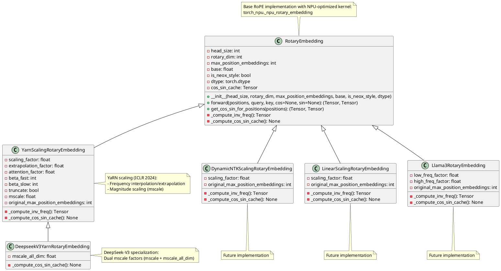
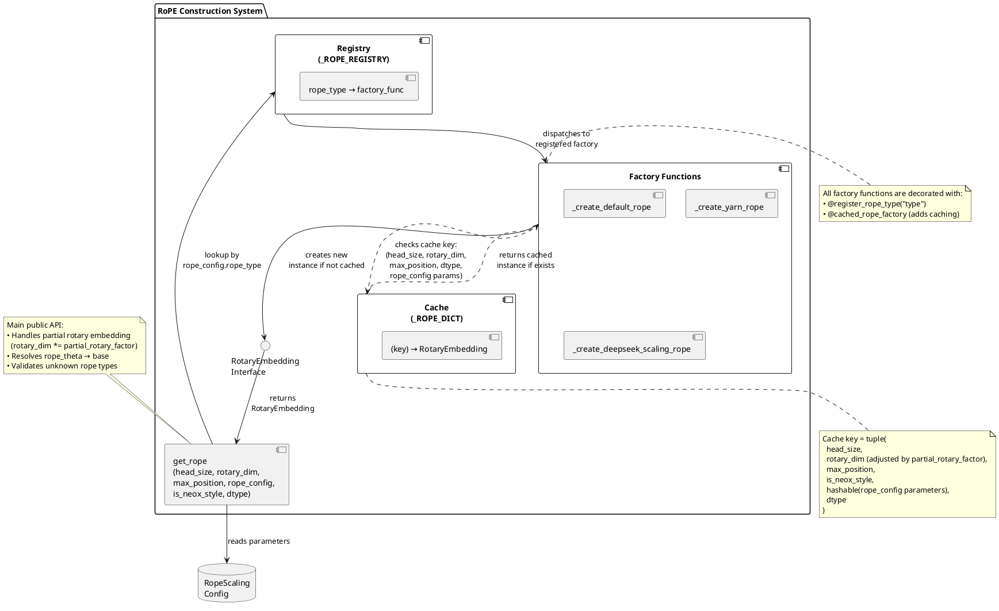
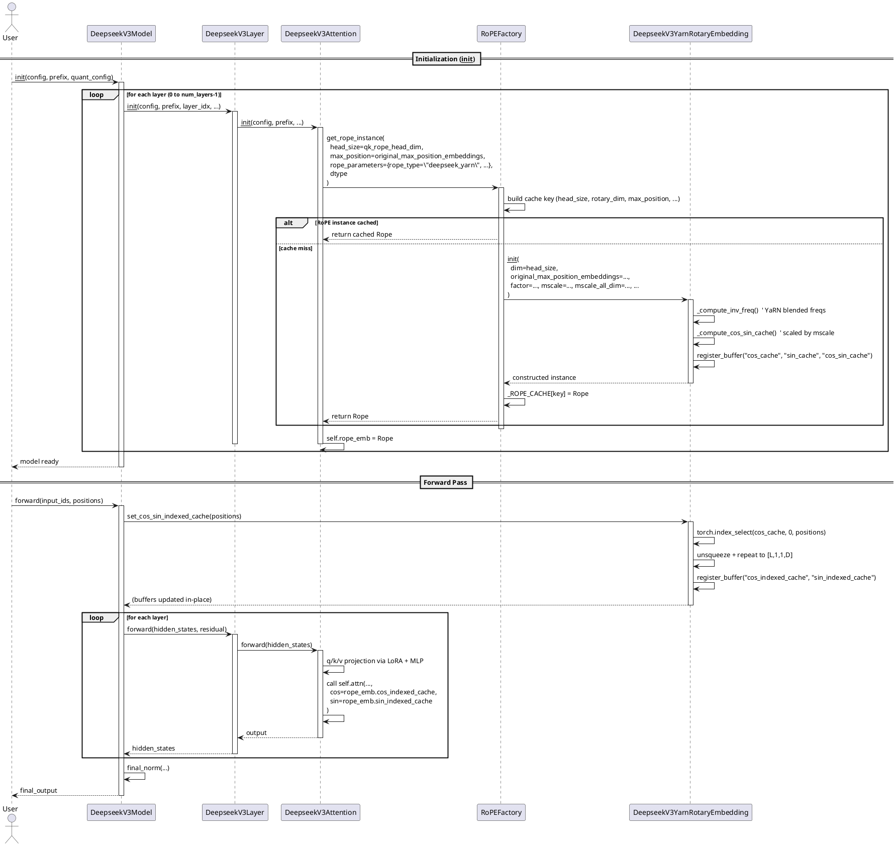

# RoPE类图



# get rope逻辑



# 运行时序图（以DSv32为例）



# get_rope 使用指南

## 概述

`get_rope` 提供了一个灵活的注册机制来创建和管理不同类型的 Rotary Position Embedding (RoPE) 实例。通过注册机制，模型特定的 RoPE 实现可以放在各自的模型文件中，而不是集中在工厂类中。

## 核心特性

1. **注册机制**：通过 `@register_rope_type` 装饰器注册自定义 RoPE 类型
2. **自动缓存**：相同配置的 RoPE 实例会被自动缓存，避免重复创建
3. **模型特定支持**：模型特定的外推方式（如 DeepseekV3YarnRotaryEmbedding）可以在模型文件中注册

## 使用方式

### 1. 使用默认或者已经注册 RoPE

```python
from mindie_llm.runtime.layers.embedding.rotary_embedding import get_rope

self.rope_emb = get_rope(
            self.head_dim,
            self.head_dim,
            self.config.rope_scaling.max_position_embeddings,
            is_neox_style=True,
            rope_config=config.rope_scaling,
        )

 ...
 # 使用方式
 # 根据postions设置cos_sin_indexed_cache
self.layers[0].self_attn.rope_emb.set_cos_sin_indexed_cache(positions)
...
 # 1. 调用forward直接对query,key进行rope变换
query, key = self.rope_emb(positions, query, key) 
...
# 2. 直接拿出cos, sin交给attention 后端使用
return self.attn(hidden_states,
                        cos=self.rope_emb.cos_indexed_cache,
                        sin=self.rope_emb.sin_indexed_cache)
```

### 2. 实现模型特定的 RoPE 类型 （以deepseekv3为例）

#### 2.1 rope模块实现

在模型目录下定义自己的rope实现（例如 `mindie_llm/runtime/models/deepseek_v3/deepseek_v3_yarn_scaling_rope.py`）：

> 可以选择继承mindie_llm/runtime/layers/embedding/rotary_embedding/base.py下的RotaryEmbedding

> 或者继承mindie_llm/runtime/layers/embedding/rotary_embedding/yarn_scaling_rope.py 下的YarnScalingRotaryEmbedding用于外推

```python
from mindie_llm.runtime.layers.embedding.rotary_embedding.yarn_scaling_rope import (
    YarnScalingRotaryEmbedding,
    yarn_get_mscale
)


class DeepseekV3YarnRotaryEmbedding(YarnScalingRotaryEmbedding):
    """DeepSeek-V3 specialized YaRN rotary embedding with mscale_all_dim scaling.

    Extends standard YaRN scaling with DeepSeek-V3's additional magnitude scaling
    parameter (mscale_all_dim) for fine-grained attention magnitude control.
    """
    def __init__(
        self,
        dim,
        original_max_position_embeddings=4096,
        base=10000,
        factor=1.0,
        beta_fast=32,
        beta_slow=1,
        is_neox_style=True,
        dtype=None,
        mscale=1.0,
        mscale_all_dim=1.0,
    ) -> None:
        """Initialize DeepSeek-V3 YaRN rotary embedding.

        Args:
            dim: Rotary embedding dimension (applied to both head and rotary dims).
            original_max_position_embeddings: Original context length before scaling.
            base: Base frequency for rotary embedding (theta).
            factor: Context extension scaling factor (>1.0 for extrapolation).
            beta_fast: YaRN fast decay window parameter.
            beta_slow: YaRN slow decay window parameter.
            is_neox_style: Use NeoX-style interleaved rotation (default: True).
            dtype: Data type for embedding tensors (e.g., torch.float16).
            mscale: Base magnitude scaling factor for attention preservation.
            mscale_all_dim: DeepSeek-V3 specific scaling factor applied across all dimensions.
        """
        self.mscale_all_dim = mscale_all_dim
        super().__init__(dim, dim, original_max_position_embeddings, base,
        dtype=dtype,
            is_neox_style=is_neox_style,
            factor=factor,
            beta_fast=beta_fast,
            beta_slow=beta_slow,
            mscale=mscale
        )

    def set_cos_sin_indexed_cache(self, postions) -> None:
        """Create position-indexed cosine/sine caches with dimension doubling.

        Extracts position-specific rotary values from precomputed caches and
        duplicates them across the last dimension to match attention head layout.

        Args:
            postions: 1D tensor of position indices to index into the cache.
        """
        cos_indexed_cache = torch.index_select(self.cos_cache, dim=0, index=postions.view(-1)).unsqueeze(1).unsqueeze(1)
        sin_indexed_cache = torch.index_select(self.sin_cache, dim=0, index=postions.view(-1)).unsqueeze(1).unsqueeze(1) 
        cos_indexed_cache = torch.cat((cos_indexed_cache, cos_indexed_cache), dim=-1)
        sin_indexed_cache = torch.cat((sin_indexed_cache, sin_indexed_cache), dim=-1)
        self.register_buffer("cos_indexed_cache", cos_indexed_cache, persistent=False) # [seq_len, 1, 1, rotary_dim]
        self.register_buffer("sin_indexed_cache", sin_indexed_cache, persistent=False)

    def _compute_cos_sin_cache(self) -> None:
        """Precompute cosine/sine caches with DeepSeek-V3 specific magnitude scaling.

        Applies dual scaling factors (mscale and mscale_all_dim) to preserve attention
        magnitude during context extrapolation. The effective scale is mscale/mscale_all_dim.
        """
        t = torch.arange(
            self.max_position_embeddings
        ).to(torch.float32)
        freqs = torch.einsum("i,j -> ij", t, self.inv_freq)
        _mscale = float(
            yarn_get_mscale(self.scaling_factor, self.mscale)
            / yarn_get_mscale(self.scaling_factor, self.mscale_all_dim)
        )
        cos = freqs.cos().to(self.dtype) * _mscale
        sin = freqs.sin().to(self.dtype) * _mscale
        self.register_buffer("cos_cache", cos, persistent=False) # [max_position_embeddings, rotary_dim // 2]
        self.register_buffer("sin_cache", sin, persistent=False) # [max_position_embeddings, rotary_dim // 2]

```

#### 2.2  实现自定义的rope构造函数并注册

注册函数必须使用装饰器@register_rope_type("xxxx")
@cached_rope_factory：

```python
@register_rope_type("deepseek_yarn")
@cached_rope_factory
def _create_deepseek_scaling_rope(
    head_size: int,
    rotary_dim: int,
    max_position: int,
    base: float,
    is_neox_style: bool,
    dtype: torch.dtype,
    rope_config: RopeScaling,
) -> RotaryEmbedding:
    """Factory function for creating DeepSeek-V3 YaRN-scaled RotaryEmbedding.

    Specialized implementation for DeepSeek-V3 architecture with YaRN scaling
    and DeepSeek-specific parameters like mscale_all_dim.

    Args:
        head_size: Dimension of each attention head.
        rotary_dim: Dimensionality of the rotary embedding subspace.
        max_position: Target maximum sequence length after scaling.
        base: Base value for frequency computation (theta).
        is_neox_style: Whether to use NeoX-style interleaved rotation.
        dtype: Data type for embedding tensors.
        rope_config: Configuration object containing DeepSeek-specific parameters:
            - original_max_position_embeddings: Original context length before scaling
            - factor: Scaling factor for context extension
            - beta_fast/beta_slow: YaRN attention window parameters
            - mscale: Magnitude scaling factor
            - mscale_all_dim: DeepSeek-specific magnitude scaling dimension parameter

    Returns:
        Initialized DeepseekV3YarnRotaryEmbedding instance.
    """
    ds_yarn_extra_keys = (
        "factor",
        "beta_fast",
        "beta_slow",
        "mscale",
        "mscale_all_dim"
        )
    extra_kwargs = {
        k: getattr(rope_config, k)
        for k in ds_yarn_extra_keys
    }
    return DeepseekV3YarnRotaryEmbedding(
        rotary_dim,
        rope_config.original_max_position_embeddings,
        base,
        is_neox_style=is_neox_style,
        dtype=dtype,
        **extra_kwargs,
    )
```

## 缓存机制

`get_rope` 会自动缓存相同配置的 RoPE 实例。缓存键基于：

- `head_size`
- `rotary_dim` (由 `head_size * partial_rotary_factor` 计算)
- `max_position`
- `is_neox_style`
- `base`
- `rope_config` (列表会被转换为元组以确保稳定性)
- `dtype`

这意味着相同配置的多次调用会返回同一个实例，节省内存和计算资源。

## 已注册的类型

- `default`: 标准 RotaryEmbedding（默认）
- `yarn`: YarnScalingRotaryEmbedding
- `deepseek_yarn`: DeepseekV3YarnRotaryEmbedding

## 注意事项

1. **模型特定类型应在模型文件中注册**：如 `DeepseekV3YarnRotaryEmbedding` 应该在 `mindie_llm/runtime/models/deepseek_v3/` 目录下的文件中注册，而不是在 `rotary_embedding/__init__.py` 中。
2. **注册时机**：确保在使用 `get_rope` 之前完成注册。通常这发生在模块导入时。
3. **参数提取**：注册函数应该从 `rope_config` 中提取所需的参数，而不是期望所有参数都通过位置参数传递。
4. **向后兼容**：现有的代码无需修改即可继续工作，如果新增模型需要新的rope，请单独实现自己的rope模块并注册使用，做增量修改，不要修改原有代码，否则须测试相关场景。

# ROPE & Yarn原理 (结合代码)

## 一、位置编码的核心目标

**位置编码的目的是让Transformer模型感知token的****相对位置关系**。理想的位置编码应满足：

* **注意力分数随相对距离增大而****单调衰减**：`pos₀,₀ > pos₀,₁ > pos₀,₂ > ... > pos₀,ₙ`
* **能够建模****相对位置**而非仅绝对位置，使模型具备位置泛化能力

---

## 二、RoPE（Rotary Position Embedding）原理

### 核心思想

**RoPE不将位置编码与embedding相加**，而是在计算注意力前对Q/K向量进行**旋转变换**，使内积天然包含相对位置信息

### 旋转矩阵定义

**对位置索引 **`m`，旋转角度 `θ_m = m·θ₀`（`θ₀` 为基础频率），2D旋转矩阵为：

$$
R_m(\theta) =  \begin{bmatrix} \cos(m\theta_0) & -\sin(m\theta_0) \\ \sin(m\theta_0) & \cos(m\theta_0) \end{bmatrix}
$$

**在高维空间中，RoPE将向量按2维一组分块，每组使用不同的基础频率 **`θ₀^(i)` 进行旋转 [[5]]。

### 关键数学性质

**对位置 **`m` 的query `q_m` 和位置 `n` 的key `k_n`，经RoPE变换后：

$$
\langle R_m q_m,\; R_n k_n \rangle = \langle R_{m-n} q_m,\; k_n \rangle
$$

**内积仅依赖相对位置 `(m-n)`**，天然实现相对位置编码。

#### 推导如下：

**考虑单个 2D 子空间的旋转矩阵乘积：**

$$
\begin{aligned} R(m, i)^\top R(n, i)  &=  \begin{bmatrix} \cos(m\theta_i) & \sin(m\theta_i) \\ -\sin(m\theta_i) & \cos(m\theta_i) \end{bmatrix} \begin{bmatrix} \cos(n\theta_i) & -\sin(n\theta_i) \\ \sin(n\theta_i) & \cos(n\theta_i) \end{bmatrix} \\[6pt] &=  \begin{bmatrix} \cos(m\theta_i)\cos(n\theta_i) + \sin(m\theta_i)\sin(n\theta_i) &  -\cos(m\theta_i)\sin(n\theta_i) + \sin(m\theta_i)\cos(n\theta_i) \\ -\sin(m\theta_i)\cos(n\theta_i) + \cos(m\theta_i)\sin(n\theta_i) &  \sin(m\theta_i)\sin(n\theta_i) + \cos(m\theta_i)\cos(n\theta_i) \end{bmatrix} \\[6pt] &=  \begin{bmatrix} \cos((n - m)\theta_i) & -\sin((n - m)\theta_i) \\ \sin((n - m)\theta_i) & \cos((n - m)\theta_i) \end{bmatrix} \\[6pt] &= R(n - m, i) \end{aligned}
$$

### 高维旋转矩阵（分块对角形式）

**对于 $d$ 维向量，$R(m)$ 是一个 $d \times d$ 的分块对角矩阵，每 2 维构成一个独立的旋转子空间：**

$$
R(m) =  \begin{bmatrix} \cos(m\theta_0) & -\sin(m\theta_0) & 0 & 0 & \cdots & 0 & 0 \\ \sin(m\theta_0) & \cos(m\theta_0) & 0 & 0 & \cdots & 0 & 0 \\ 0 & 0 & \cos(m\theta_1) & -\sin(m\theta_1) & \cdots & 0 & 0 \\ 0 & 0 & \sin(m\theta_1) & \cos(m\theta_1) & \cdots & 0 & 0 \\ \vdots & \vdots & \vdots & \vdots & \ddots & \vdots & \vdots \\ 0 & 0 & 0 & 0 & \cdots & \cos(m\theta_{k}) & -\sin(m\theta_{k}) \\ 0 & 0 & 0 & 0 & \cdots & \sin(m\theta_{k}) & \cos(m\theta_{k}) \end{bmatrix}
$$

**其中 $k = \frac{d}{2} - 1$，$\theta_i$ 为第 $i$ 个旋转子空间的基础频率。**

### 基础频率定义

$$
\theta_i = 10000^{-\frac{2i}{d}}, \quad i = 0, 1, \dots, \frac{d}{2} - 1
$$

### 全局性质

**由于 $R(m)$ 是分块对角矩阵，上述性质对所有子空间成立，因此：**

$$
R(m)^\top R(n) = R(n - m)
$$

**代入注意力分数：**

$$
\text{score} = q_m^\top R(n - m) k_n
$$

---

### 标准 RoPE（相邻元素分组）

#### 1. 分组规则

**将 $d$ 维向量按****相邻两个元素**分为 $\frac{d}{2}$ 组：

$$
(q_0, q_1),\; (q_2, q_3),\; \dots,\; (q_{2i}, q_{2i+1}),\; \dots,\; (q_{d-2}, q_{d-1})
$$

#### 2. 旋转变换（元素级实现）

对位置 $m$，第 $i$ 组 $(q_{2i}, q_{2i+1})$ 的旋转结果为：

$$
\begin{aligned} \tilde{q}_{2i}     &= q_{2i} \cos(m\theta_i) - q_{2i+1} \sin(m\theta_i) \\ \tilde{q}_{2i+1} &= q_{2i} \sin(m\theta_i) + q_{2i+1} \cos(m\theta_i) \end{aligned}
$$

**其中 $\theta_i = 10000^{-\frac{2i}{d}}$。**

#### 3. 向量形式

$$
R(m) q =  \begin{bmatrix} q_0 \cos(m\theta_0) - q_1 \sin(m\theta_0) \\ q_0 \sin(m\theta_0) + q_1 \cos(m\theta_0) \\ q_2 \cos(m\theta_1) - q_3 \sin(m\theta_1) \\ q_2 \sin(m\theta_1) + q_3 \cos(m\theta_1) \\ \vdots \\ q_{d-2} \cos(m\theta_{\frac{d}{2}-1}) - q_{d-1} \sin(m\theta_{\frac{d}{2}-1}) \\ q_{d-2} \sin(m\theta_{\frac{d}{2}-1}) + q_{d-1} \cos(m\theta_{\frac{d}{2}-1}) \end{bmatrix}
$$

将公式中的 $\cos$ 和 $\sin$ 项分别提取后，直接以向量形式展开如下：

$$
R(m)q = 
\begin{bmatrix}
\cos(m\theta_0) \\ \cos(m\theta_0) \\ \cos(m\theta_1) \\ \cos(m\theta_1) \\ \vdots \\ \cos\bigl(m\theta_{\frac{d}{2}-1}\bigr) \\ \cos\bigl(m\theta_{\frac{d}{2}-1}\bigr)
\end{bmatrix}
\odot
\begin{bmatrix}
q_0 \\ q_1 \\ q_2 \\ q_3 \\ \vdots \\ q_{d-2} \\ q_{d-1}
\end{bmatrix}
\;+\;
\begin{bmatrix}
\sin(m\theta_0) \\ \sin(m\theta_0) \\ \sin(m\theta_1) \\ \sin(m\theta_1) \\ \vdots \\ \sin\bigl(m\theta_{\frac{d}{2}-1}\bigr) \\ \sin\bigl(m\theta_{\frac{d}{2}-1}\bigr)
\end{bmatrix}
\odot
\begin{bmatrix}
-q_1 \\ q_0 \\ -q_3 \\ q_2 \\ \vdots \\ -q_{d-1} \\ q_{d-2}
\end{bmatrix}
$$

其中 $\odot$ 表示逐元素相乘（Hadamard 积）。

~~~python
# 算子调用 torch_npu.npu_rotary_mul(input, r1, r2, rotary_mode='half') -> Tensor 
# 等效代码：
import torch
from einops import rearrange

# rotary_mode='half'
def rotate_half(x):
    x1, x2 = torch.chunk(x, 2, dim=-1)
    return torch.cat((-x2, x1), dim=-1)

# rotary_mode='interleave'
def rotate_interleaved(x):
   x1 = x[..., ::2]
   x2 = x[..., 1::2]
   return rearrange(torch.stack((-x2, x1), dim=-1), "... d two -> ...(d two)", two=2)

def fused_rotary_position_embedding(x, cos, sin, interleaved=False):
    if not interleaved:
        return x * cos + rotate_half(x) * sin
    else:
        return x * cos + rotate_interleaved(x) * sin
~~~

> 目前已知DeepSeekv4采用这种分组

---

### GPT-NeoX Style（首尾交叉分组）

#### 1. 分组规则

**将向量分为前后两半，**交叉配对：

$$
(q_0, q_{d/2}),\; (q_1, q_{d/2+1}),\; \dots,\; (q_i, q_{d/2+i}),\; \dots,\; (q_{d/2-1}, q_{d-1})
$$

#### 2. 旋转变换（元素级实现）

对位置 $m$，第 $i$ 组 $(q_i, q_{d/2+i})$ 的旋转结果为：

$$
\begin{aligned} \tilde{q}_i         &= q_i \cos(m\theta_i) - q_{d/2+i} \sin(m\theta_i) \\ \tilde{q}_{d/2+i} &= q_i \sin(m\theta_i) + q_{d/2+i} \cos(m\theta_i) \end{aligned}
$$

#### 3. 向量形式

$$
R_{\text{NeoX}}(m)\boldsymbol{q} = \left[\; \begin{matrix} \cos m\theta_0 & 0 & 0 & \cdots & -\sin m\theta_0 & 0 & \cdots & 0\\ 0 & \cos m\theta_1 & 0 & \cdots & 0 & -\sin m\theta_1 & \cdots & 0\\ \vdots & \vdots & \ddots & \vdots & \vdots & \vdots & \ddots & \vdots\\ 0 & 0 & \cdots & \cos\left(m\theta_{\frac{d}{2}-1}\right) & 0 & \cdots & -\sin\left(m\theta_{\frac{d}{2}-1}\right)\\ \sin m\theta_0 & 0 & \cdots & 0 & \cos m\theta_0 & 0 & \cdots & 0\\ 0 & \sin m\theta_1 & \cdots & 0 & 0 & \cos m\theta_1 & \cdots & 0\\ \vdots & \vdots & \ddots & \vdots & \vdots & \vdots & \ddots & \vdots\\ 0 & 0 & \cdots & \sin\left(m\theta_{\frac{d}{2}-1}\right) & 0 & \cdots & \cos\left(m\theta_{\frac{d}{2}-1}\right) \end{matrix} \;\right] \begin{bmatrix} q_0\\ q_1\\ \vdots\\ q_{\frac{d}{2}-1}\\ q_{\frac{d}{2}}\\ q_{\frac{d}{2}+1}\\ \vdots\\ q_{d-1} \end{bmatrix}
$$

$$
R_{\text{NeoX}}(m) q =  \begin{bmatrix} q_0 \cos(m\theta_0) - q_{d/2} \sin(m\theta_0) \\ q_1 \cos(m\theta_1) - q_{d/2+1} \sin(m\theta_1) \\ q_2 \cos(m\theta_2) - q_{d/2+2} \sin(m\theta_2) \\ \vdots \\ q_{d/2-1} \cos(m\theta_{d/2-1}) - q_{d-1} \sin(m\theta_{d/2-1}) \\ q_0 \sin(m\theta_0) + q_{d/2} \cos(m\theta_0) \\ q_1 \sin(m\theta_1) + q_{d/2+1} \cos(m\theta_1) \\ q_2 \sin(m\theta_2) + q_{d/2+2} \cos(m\theta_2) \\ \vdots \\ q_{d/2-1} \sin(m\theta_{d/2-1}) + q_{d-1} \cos(m\theta_{d/2-1}) \end{bmatrix}
$$

将 NeoX 风格 RoPE 公式中的 $\cos$ 和 $\sin$ 项分别提取后，直接以向量形式展开如下：

$$
R_{\text{NeoX}}(m)q = 
\begin{bmatrix}
\cos(m\theta_0) \\
\cos(m\theta_1) \\
\cos(m\theta_2) \\
\vdots \\
\cos\bigl(m\theta_{\frac{d}{2}-1}\bigr) \\
\cos(m\theta_0) \\
\cos(m\theta_1) \\
\cos(m\theta_2) \\
\vdots \\
\cos\bigl(m\theta_{\frac{d}{2}-1}\bigr)
\end{bmatrix}
\odot
\begin{bmatrix}
q_0 \\
q_1 \\
q_2 \\
\vdots \\
q_{\frac{d}{2}-1} \\
q_{\frac{d}{2}} \\
q_{\frac{d}{2}+1} \\
q_{\frac{d}{2}+2} \\
\vdots \\
q_{d-1}
\end{bmatrix}
\;+\;
\begin{bmatrix}
\sin(m\theta_0) \\
\sin(m\theta_1) \\
\sin(m\theta_2) \\
\vdots \\
\sin\bigl(m\theta_{\frac{d}{2}-1}\bigr) \\
\sin(m\theta_0) \\
\sin(m\theta_1) \\
\sin(m\theta_2) \\
\vdots \\
\sin\bigl(m\theta_{\frac{d}{2}-1}\bigr)
\end{bmatrix}
\odot
\begin{bmatrix}
-q_{\frac{d}{2}} \\
-q_{\frac{d}{2}+1} \\
-q_{\frac{d}{2}+2} \\
\vdots \\
-q_{d-1} \\
q_0 \\
q_1 \\
q_2 \\
\vdots \\
q_{\frac{d}{2}-1}
\end{bmatrix}
$$

其中 $\odot$ 表示逐元素相乘（Hadamard 积）。

> 目前已知Qwen3-32B采用这种形式

---

##### 代码

~~~python
class RotaryEmbedding(nn.Module):
    def __init__(
        self,
        head_size: int,
        rotary_dim: int,
        max_position_embeddings: int,
        base: float,
        is_neox_style: bool = True,
        dtype=None
    ) -> None:
        super().__init__()
        self.head_size = head_size
        self.rotary_dim = rotary_dim
        self.max_position_embeddings = max_position_embeddings
        self.base = base
        self.is_neox_style = is_neox_style
        self.dtype = dtype if dtype else torch.get_default_dtype()

        self._compute_inv_freq()
        self._compute_cos_sin_cache()

    def forward(
        self,
        positions: torch.Tensor,
        query: torch.Tensor,
        key: torch.Tensor,
    ) -> tuple[torch.Tensor, torch.Tensor]:
        query_shape = query.shape
        key_shape = key.shape
        cos = self.cos_indexed_cache
        sin = self.sin_indexed_cache
        if self._npu_apply_rotary_pos_emb_support():
            # If cos and sin are generated outside, use npu_apply_rotary_pos_emb to avoid redundant calculation.
            # This method requires head_size and rotary_dim equal 128 and neox_style is True
            query = query.contiguous().view(1, query_shape[0], -1,
                                            self.head_size) # [1, B*S, N_head, D]
            key = key.contiguous().view(1, key_shape[0], -1,
                                            self.head_size) # [1, B*S, N_head, D]
            # Although this function modifies in-place, please retain the function's return value.
            # Otherwise, the graph fusion operation may fail.

            query, key = torch_npu.npu_apply_rotary_pos_emb(
                query, key, cos, sin)
            return query, key
        else:
            _msg = ("This method requires head_size and rotary_dim equal 128 and neox_style is True. "
                    f"{self.is_neox_style=}, "
                    f"{self.head_size=}, "
                    f"{self.cos_indexed_cache.shape[-1]=}, "
                    f"{self.sin_indexed_cache.shape[-1]=}.")
            logger.error(_msg)
            raise ValueError(_msg)

    def _npu_apply_rotary_pos_emb_support(self) -> bool:
        return (
            self.is_neox_style
            and self.head_size == 128
            and self.cos_indexed_cache.shape[-1] == 128
            and self.sin_indexed_cache.shape[-1] == 128
        )

    def _compute_inv_freq(self):
        inv_freq = 1.0 / (
            self.base
            ** (
                torch.arange(0, self.rotary_dim, 2).to(torch.float32) / self.rotary_dim
            )
        )
        self.register_buffer("inv_freq", inv_freq, persistent=False) # [rotary_dim // 2, ]

    def _compute_cos_sin_cache(self) -> None:
        t = torch.arange(self.max_position_embeddings).to(torch.float32) # [max_position_embeddings, ]
        freqs = torch.einsum("i,j -> ij", t, self.inv_freq)
        cos = freqs.cos().to(self.dtype)
        sin = freqs.sin().to(self.dtype)
        self.register_buffer("cos_cache", cos, persistent=False) # [max_position_embeddings, rotary_dim // 2]
        self.register_buffer("sin_cache", sin, persistent=False) # [max_position_embeddings, rotary_dim // 2]
~~~

## 三、NTK-RoPE 核心思想：缩放 Base 参数

### 1. 方法

**将 base 参数从 $b$ 缩放为：**

$$
b' = s \cdot b, \quad s > 1
$$

**其中缩放因子 $s$ 通常设为：**

$$
s = \max\left(1,\; \frac{L_{\text{target}}}{L_{\text{train}}}\right)
$$

### 2. 频率变化

**新频率为：**

$$
\theta_i' = (s \cdot b)^{-\frac{2i}{d}} = b^{-\frac{2i}{d}} \cdot s^{-\frac{2i}{d}} = \theta_i \cdot s^{-\frac{2i}{d}}
$$

### 3. 旋转角度等效变换

**对位置 $m$，旋转角度变为：**

$$
m \theta_i' = m \cdot \theta_i \cdot s^{-\frac{2i}{d}} = \underbrace{\left(m \cdot s^{-\frac{2i}{d}}\right)}_{\text{等效位置}} \cdot \theta_i
$$

**等效于将位置 $m$ 按维度相关因子 $s^{-2i/d}$ 缩放**。

## 四、Yarn原理

---

### 一、波长（Wavelength）定义

**在 RoPE 中，第 $i$ 个旋转维度的基础频率为：**

$$
\theta_i = b^{-\frac{2i}{d}}, \quad i = 0, 1, \dots, \frac{d}{2}-1
$$

**其对应的波长**（完成一次 $2\pi$ 旋转所需的 token 数）定义为：

$$
\lambda_i = \frac{2\pi}{\theta_i} = 2\pi \cdot b^{\frac{2i}{d}}
$$

#### 波长的物理意义

| **维度类型**       | **$i$ 范围**         | **$\theta_i$** | **$\lambda_i$**     | **编码特性**                     |
| -------------------- | ------------------------ | -------------------- | ------------------------- | ---------------------------------- |
| **高频维度** | **$i \approx 0$**   | **大**             | **小（如 10\~100）**    | **编码短距离**相对位置 |
| **低频维度** | **$i \approx d/2$** | **小**             | **大（如 10⁴\~10⁶）** | **编码长距离**相对位置 |

> **✅ 关键观察**：波长 $\lambda_i$ 随维度 $i$ **指数增长**，不同维度天然负责不同尺度的位置关系建模。

### 二、NTK-by-parts 插值核心机制

#### 1. 关键比值：上下文长度与波长之比

**定义维度 $i$ 的尺度比**：

$$
r(i) = \frac{L_{\text{train}}}{\lambda_i}
$$

**其中：**

* **$L_{\text{train}}$：训练时的最大上下文长度（如 2048）**
* **$\lambda_i$：维度 $i$ 的波长**

**物理意义**：

* **$r(i) \ll 1$：波长远大于上下文 → 该维度在训练中****未完成完整周期**，处于“高频敏感区”
* **$r(i) \gg 1$：波长远小于上下文 → 该维度在训练中****已完成多周期**，处于“低频稳定区”

#### 2. 分段缩放函数

**YaRN 引入分段函数 $f(r)$，控制不同维度的缩放强度：**

**基于尺度比 $r(i) = \dfrac{L_{\text{train}}}{\lambda_i}$，YaRN 的分段缩放函数为：**

$$
f(r) =  \begin{cases} 0, & r < \alpha \quad (\text{高频保护区}) \\ 1, & r > \beta \quad (\text{低频缩放区}) \\ \dfrac{r - \alpha}{\beta - \alpha}, & \alpha \leq r \leq \beta \quad (\text{过渡区}) \end{cases}
$$

### 2. 参数 $\alpha = 1$, $\beta = 32$ 的物理含义

| **条件**             | **数学表达**               | **波长范围**                                                             | **缩放行为**                                                                                                                                                                     |
| ---------------------- | ---------------------------- | -------------------------------------------------------------------------- | --------------------------------------------------------------------------------- | 
| **高频保护区** | **$r < 1$**              | **$\lambda_i > L_{\text{train}}$**                                 | **$f(r)=0 \Rightarrow \theta_i' = \theta_i$** **保持原始频率**     |
| **过渡区**     | **$1 \leq r \leq 32$** | $L*{\text{train}}/32 \leq \lambda_i \leq L*{\text{train}}$ | **$f(r) \in (0,1)$** **渐进缩放**
| **低频缩放区** | **$r > 32$**             | **$\lambda_i < L_{\text{train}}/32$**                              | **$f(r)=1 \Rightarrow \theta_i' = \theta_i / s$** **完全线性插值**

---

### 三、预 softmax 温度缩放机制

温度缩放公式

**在 softmax 前引入温度参数 $t$：**

$$
\text{Attention} = \text{softmax}\left( \frac{QK^\top}{\sqrt{d_k} \cdot t} \right) V
$$

**YaRN 通过大量实验发现最优温度满足：**

$$
\frac{1}{t} = 0.1 \cdot \ln(s) + 1 \quad \Rightarrow \quad t = \frac{1}{0.1 \cdot \ln(s) + 1}
$$

其中 $s = \dfrac{L_{\text{target}}}{L_{\text{train}}}$ 为上下文扩展因子。

##### 代码

~~~python
def yarn_get_mscale(scale: float = 1.0, mscale: float = 1.0):
    """Compute YaRN magnitude scaling factor."""
    if scale <= 1:
        return 1.0
    return 0.1 * mscale * math.log(scale) + 1.0


def yarn_find_correction_dim(
    num_rotations: int,
    dim: int,
    base: float = 10000,
    max_position_embeddings: int = 2048,
) -> float:
    """Compute dimension index for given number of rotations."""
    return (dim * math.log(max_position_embeddings / (num_rotations * 2 * math.pi))) / (
        2 * math.log(base)
    )


def yarn_find_correction_range(
    low_rot: int,
    high_rot: int,
    dim: int,
    base: float = 10000,
    max_position_embeddings: int = 2048,
    truncate: bool = True,
) -> tuple[float | int, float | int]:
    """Compute [low, high] dimension range for frequency blending."""
    low = yarn_find_correction_dim(low_rot, dim, base, max_position_embeddings)
    high = yarn_find_correction_dim(high_rot, dim, base, max_position_embeddings)
    if truncate:
        low = math.floor(low)
        high = math.ceil(high)
    return max(low, 0), min(high, dim - 1)  # Clamp values just in case


def yarn_linear_ramp_mask(
    low: float, high: float, dim: int, dtype: torch.dtype = torch.float32
) -> torch.Tensor:
    """Linear ramp mask from 1 (at low) to 0 (at high)."""
    if low == high:
        high += 0.001  # Prevent singularity

    linear_func = (torch.arange(dim, dtype=dtype) - low) / (high - low)
    ramp_func = torch.clamp(linear_func, 0, 1)
    return ramp_func


class YarnScalingRotaryEmbedding(RotaryEmbedding):
    def __init__(
        self,
        head_size: int,
        rotary_dim: int,
        original_max_position_embeddings: int,
        base: float,
        is_neox_style: bool,
        dtype: torch.dtype = None,
        *,
        factor=1,
        extrapolation_factor: float = 1,
        attention_factor: float = 1,
        beta_fast: int = 32,
        beta_slow: int = 1,
        apply_yarn_scaling: bool = True,
        truncate: bool = True,
        mscale: float | None = 1.0
    ) -> None:
        self.scaling_factor = factor
        self.extrapolation_factor = extrapolation_factor
        self.attention_factor = attention_factor
        self.beta_fast = beta_fast
        self.beta_slow = beta_slow
        self.truncate = truncate
        self.mscale = mscale if mscale else (
            float(yarn_get_mscale(self.scaling_factor) * self.attention_factor)
            if apply_yarn_scaling
            else float(self.attention_factor)
        )
        self.original_max_position_embeddings = original_max_position_embeddings
        max_position_embeddings = int(self.scaling_factor * original_max_position_embeddings)
        super().__init__(head_size, rotary_dim, max_position_embeddings, base, is_neox_style, dtype)

    def set_cos_sin_indexed_cache(self, positions) -> None:
        cos = torch.index_select(self.cos_cache, dim=0, index=positions)
        sin = torch.index_select(self.sin_cache, dim=0, index=positions)
        cos_indexed_cache = cos.repeat(1, 2).view(1, -1, 1, self.head_size).contiguous()
        sin_indexed_cache = sin.repeat(1, 2).view(1, -1, 1, self.head_size).contiguous()
        self.register_buffer("cos_indexed_cache", cos_indexed_cache, persistent=False) # [seq_len, 1, 1, rotary_dim]
        self.register_buffer("sin_indexed_cache", sin_indexed_cache, persistent=False)

    def _compute_inv_freq(self) -> None:
        pos_freqs = self.base ** (
            torch.arange(0, self.rotary_dim, 2).to(torch.float32) / self.rotary_dim
        )
        inv_freq_extrapolation = 1.0 / pos_freqs
        inv_freq_interpolation = 1.0 / (self.scaling_factor * pos_freqs)

        low, high = yarn_find_correction_range(
            self.beta_fast,
            self.beta_slow,
            self.rotary_dim,
            self.base,
            self.original_max_position_embeddings,
            self.truncate,
        )
        # Get n-d rotational scaling corrected for extrapolation
        inv_freq_mask = (
            1
            - yarn_linear_ramp_mask(low, high, self.rotary_dim // 2, dtype=torch.float32)
        ) * self.extrapolation_factor
        inv_freq = (
            inv_freq_interpolation * (1 - inv_freq_mask)
            + inv_freq_extrapolation * inv_freq_mask
        )
        self.register_buffer("inv_freq", inv_freq, persistent=False)

    def _compute_cos_sin_cache(self) -> tuple[torch.Tensor, torch.Tensor, torch.Tensor]:
        """Precompute cosine and sine caches for the extended context length.

        The cache length is `max_position_embeddings`, and all values
        are scaled by `mscale` to preserve attention magnitude.

        Returns:
            A tuple of (cos, sin, cos_sin) tensors, where:
                - cos/sin: Shape `[max_position_embeddings, rotary_dim // 2]`
        """
        t = torch.arange(
            self.max_position_embeddings
        ).to(torch.float32)
        freqs = torch.einsum("i,j -> ij", t, self.inv_freq)
        cos = freqs.cos().to(self.dtype) * self.mscale
        sin = freqs.sin().to(self.dtype) * self.mscale
        self.register_buffer("cos_cache", cos, persistent=False) # [max_position_embeddings, rotary_dim // 2]
        self.register_buffer("sin_cache", sin, persistent=False) # [max_position_embeddings, rotary_dim // 2]
~~~

~~~

~~~
